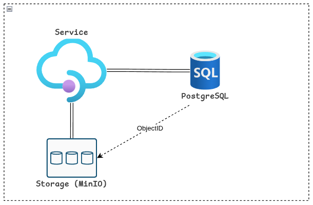

# Sistema Gerenciador de Artistas e Álbuns 

## Dados da Vaga

|Informação|Descrição|
|---|---|
|**Candidato:**|José Quintino da Silva Junior|
|**CPF:**|027.350.XXX-XX|
|**Nome do Projeto:**|josequintinodasilvajunior027350|
|**Vaga:**|Analista de Tecnologia da Informação – Engenharia da Computação|
|**Processo:**|SEPLAG - Governo do Estado de Mato Grosso|
|**Data de entrega:**|05/02/2026|

---

## Objetivo
Implementar uma solução para gerenciamento de artistas e álbuns, com autenticação JWT, upload de capas em MinIO, consultas paginadas e notificações em tempo real via WebSocket, conforme requisitos do [Edital](https://seletivo.seplag.mt.gov.br/ver-edital/397).

---

## Arquitetura

|Informação|Descrição|
|---|---|
|**Back end:**|Java 21 + Spring Boot (v3.5.9)|
|**Banco de Dados:**|PostgreSQL (v15)|
|**Storage:**|MinIO (API S3) |
|**Orquestração:**|Docker Compose (API + BD + MinIO)|
|**Extras:**|WebSocket, Rate Limit, Health Checks, Testes unitários|
|**Observabilidade:**|Health Checks e Liveness/Readiness|

---

## API

|Dependências|
|---|
|Spring Boot DevTools|
|Spring Web|
|Spring Security|
|Spring Data JPA|
|Flyway Migration|
|PostgreSQL Driver|
|Validation|
|Java Mail Sender|
|Spring Boot Actuator|

---

## Requisitos do Sistema

|Requisito Funcional|Implementado?|
|---|---|
|[Autenticação JWT com expiração a cada 5 minutos e possibilidade de renovação](https://github.com/repositoryjosequintino/josequintinodasilvajunior027350/issues/4)| [] |

---

## Gestão do Projeto

A gestão do projeto será feita na aba de [Projetos](https://github.com/users/repositoryjosequintino/projects/1/views/1).